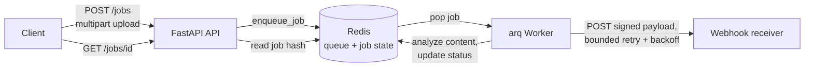

# Async Jobs

> Upload to background worker (arq/Redis) with status polling and webhooks

[](https://github.com/Prithv122/async-jobs/actions/workflows/ci.yml)

**Live demo:** not deployed — runs locally via Docker Compose (single-process demo, not built for a multi-tenant hosted deployment; see §7).
**Stack:** FastAPI · arq (Redis-backed task queue) · Redis · httpx · pytest + pytest-asyncio · Docker Compose · GitHub Actions.

---

## 1. The problem

An upload that takes real time to process (a file scan, a report render, an ML inference
pass — anything that shouldn't hold an HTTP connection open) needs somewhere for that work
to actually happen. This project is the reusable shape underneath that: an API that accepts
the upload and hands back a job id immediately, a worker that does the work out-of-band, a
way to poll for the result, and a webhook so a client that isn't polling still finds out
when it's done — including retrying a client-supplied duplicate request safely, and giving
up on a webhook delivery that never succeeds instead of retrying it forever.

## 2. The data

There's no fixed dataset — the "data" is whatever file a client uploads. The worker's own
analysis step (`processing.py`) computes real, verifiable output from that upload: byte
size, a SHA-256 checksum, and (for text files) line/word/character counts. `scripts/demo.py`
uses a small generated text file so every number in §5 is reproducible from this repo with
no external download.

| | |
|---|---|
| Source | Client-uploaded file (any content; text files get additional stats) |
| Size | Bounded at 10 MB per upload (`MAX_UPLOAD_BYTES`) |
| Licence | N/A — no shipped dataset |
| Refresh | N/A — processed per-request, nothing persisted beyond job TTL |

## 3. Architecture



Redis is both the message broker (arq's queue) and the single source of truth for job
state (a Redis hash per job) — the API and worker never talk to each other directly, and
there's no second database to keep in sync with it.

## 4. Key decisions & tradeoffs

| Decision | Chose | Over | Why |
|---|---|---|---|
| Idempotency | Client-supplied `Idempotency-Key` header, claimed with `SET NX EX` in Redis | Server-generated dedup only, or a request-body hash as the key | The client is the only party that knows "this is a retry of the same logical request," not the server. `SET NX` makes the race atomic: two concurrent requests for the same key can only ever produce one job — the loser reads back the winner's job id and creates nothing (proven in `test_store.py::test_reserve_idempotency_key_is_race_safe`, run with 10 concurrent callers). |
| Job state storage | One Redis hash per job (`job:{id}`), read/written by both API and worker | A separate Postgres/SQLite table | The catalog's scope for this project is the queue architecture itself. A second database would duplicate Redis's own atomicity guarantees and add a moving part unrelated to what's being demonstrated. |
| Webhook retry | Bounded exponential backoff (default 5 attempts, 1s base delay, doubling), then mark `webhook_status: failed` and stop | Retry forever / no retry at all | A receiver that's briefly down shouldn't lose the callback (retry), but a receiver that's permanently gone shouldn't hold a worker slot open indefinitely (bounded). `failed` is a first-class, pollable state via `GET /jobs/{id}` — the client can find out delivery didn't happen instead of waiting silently. |
| Webhook authenticity | HMAC-SHA256 over the raw JSON body, sent as `X-Webhook-Signature`, verified by recomputing on the receiver | An unsigned payload, or a shared bearer token | A bearer token proves the sender *could* call the receiver; a body signature proves the *specific payload* wasn't altered in transit and came from a holder of the shared secret — the receiver can reject a payload with a mismatched signature outright. |
| Scope boundary | No auth, no database beyond Redis, no frontend, single-process/single-host deployment | A "real" multi-tenant job platform | Explicit choice for this catalog entry (C3, Tier 2): the point being demonstrated is queues, idempotency, and long-running work — not a second pass at C2's auth/multi-tenancy story. |

## 5. Results

Every number below is reproduced by `uv run python scripts/demo.py`, which runs the real
FastAPI app against a real arq worker and a real Redis (nothing mocked) and prints exactly
this output.

| Metric | Value | Baseline | Notes |
|---|---|---|---|
| `POST /jobs` response time (single job) | 13 ms | — | No worker was blocking this call; it enqueues and returns. |
| Time from enqueue to `status: done` | 2.03 s | `simulated_work_seconds` = 2.0s | Confirms the worker actually performed the configured processing time, not an instant no-op. |
| Batch of 5 jobs: total enqueue time | 27 ms | — | ~5.4 ms/job amortized — the API path itself is not the bottleneck. |
| Batch of 5 jobs: total time until all done | 2.08 s | Naive sequential estimate: 10.0 s | 4.8× — arq's default `max_jobs=10` lets one worker process the whole batch concurrently instead of one job at a time. |
| Idempotent replay (same `Idempotency-Key`) | 202 → 200, identical `job_id` | — | Verified against a real race too: 10 concurrent reservations for one key, `test_store.py`, exactly 1 winner. |
| Webhook delivery (receiver up) | Delivered on first attempt, signature verified | — | Verified against a real local HTTP server, not a mock (`scripts/demo.py` §4). |
| Webhook delivery (receiver unreachable) | 5 attempts, exponential backoff, ~17s total, then `webhook_status: failed` | — | Verified through the actual Docker Compose stack against a real closed port, not simulated — see `NOTES.md`. |

**Test suite:** 31 tests, **100% statement coverage**, run against a real Redis (no mocked
datastore) — CI provisions a Redis 7 service container for the same reason.

## 6. How to run

```bash
git clone https://github.com/Prithv122/async-jobs.git
cd async-jobs
uv sync
cp .env.example .env   # then fill in values (defaults work for local Redis)
```

**Requires Redis.** Either run the full stack with Docker Compose:

```bash
docker compose up --build
# API:    http://localhost:8000
# Worker: consuming jobs from Redis in the background
```

...or run Redis alone and the two processes locally:

```bash
docker run -d -p 6379:6379 redis:7-alpine   # or your own local Redis
uv run async-jobs                            # terminal 1: the API
uv run arq asyncjobs.worker.WorkerSettings   # terminal 2: the worker
```

Then, from a third terminal:

```bash
curl -X POST http://localhost:8000/jobs -F "file=@README.md"
# {"job_id": "...", "status": "pending", ...}

curl http://localhost:8000/jobs/<job_id>
# status moves pending -> running -> done as the worker picks it up
```

**Tests** (need Redis reachable at `REDIS_URL`, default `redis://localhost:6379/0`; the
suite itself uses database 15 to avoid touching your dev data):

```bash
uv run pytest --cov=src
```

**Reproduce the numbers in §5:**

```bash
uv run python scripts/demo.py
```

## 7. What I'd change at 100× scale

- **Job state in Redis alone stops being enough.** A single Redis hash per job is fine at
  the volumes this project targets; at real scale you want job history queryable and
  retained past Redis's TTL horizon — that means a Postgres table the worker writes to
  alongside (or instead of) the Redis hash, with Redis staying purely the broker.
- **One worker container doesn't scale with load.** `docker-compose.yml`'s `worker` service
  is a single replica; in production this is `worker` scaled horizontally (arq workers are
  stateless beyond their Redis connection, so this is close to free) with `max_jobs` tuned
  per instance against actual work cost, not the placeholder `asyncio.sleep` used here.
- **Webhook delivery needs a dead-letter path.** Right now a permanently-failed webhook just
  sits at `webhook_status: failed` for the client to notice by polling. At scale that's a
  silent failure mode — a dead-letter queue (or at minimum an alert on the failed-delivery
  rate) is the difference between "the client eventually notices" and "someone gets paged."
- **The idempotency TTL is a policy decision, not a technical one.** 24 hours is a
  reasonable default for "retry the same upload," but a real API needs this configurable
  per-client or per-endpoint, and needs the reservation key's TTL refreshed correctly if a
  job takes longer than the TTL itself to reach a terminal state (not handled here — the
  window is generous enough that it wasn't the priority for this catalog entry, but it's a
  real edge case at scale).

---

## References

- [arq documentation](https://arq-docs.helpmanual.io/) — the task-queue library this project
  builds on; `WorkerSettings`, `enqueue_job`, and the `ctx` dict pattern all follow arq's own
  conventions rather than reinventing them.
